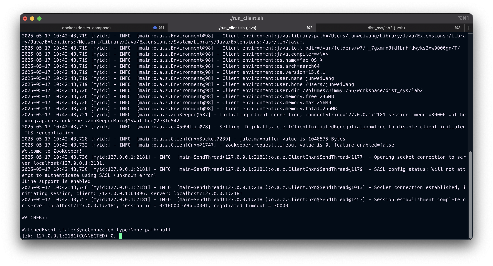
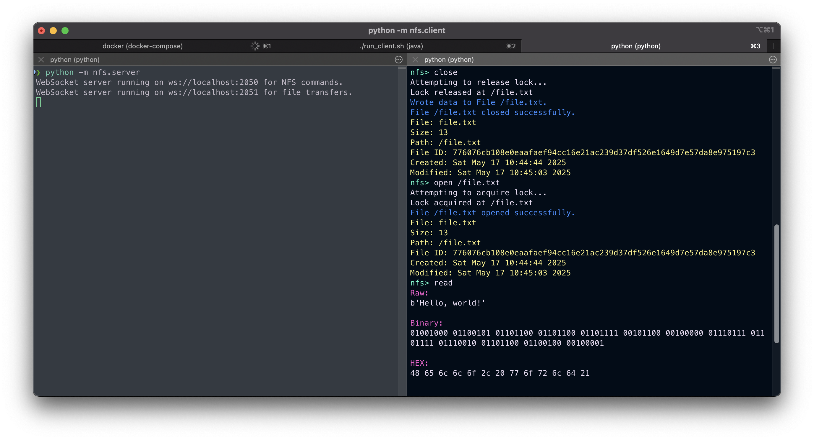
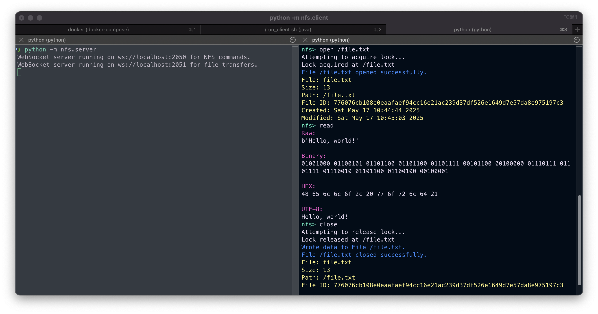
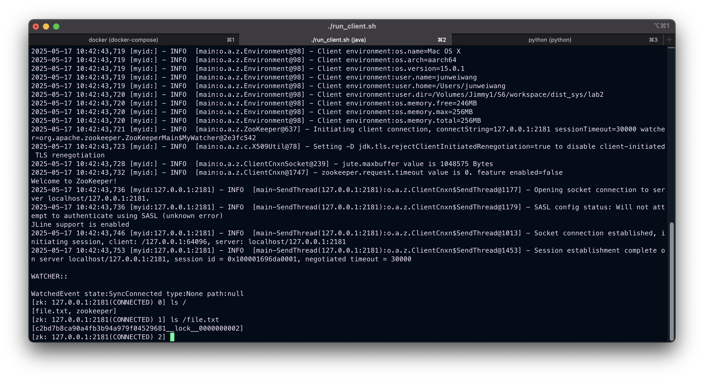
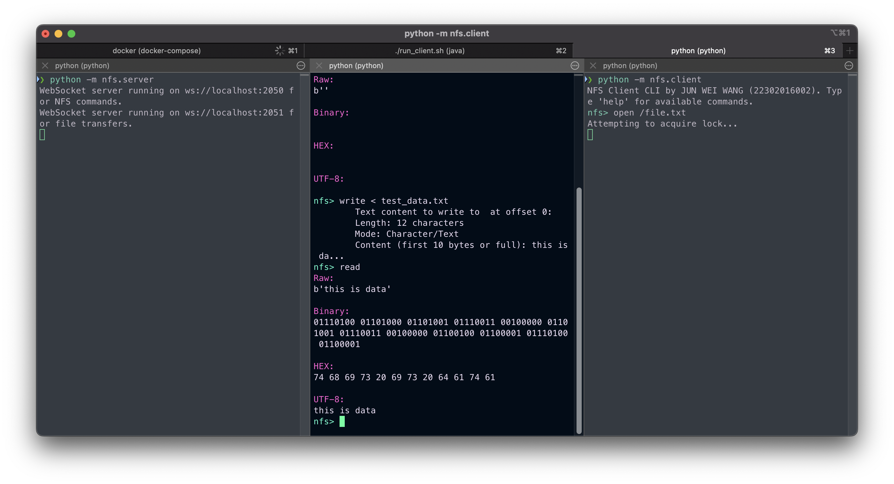
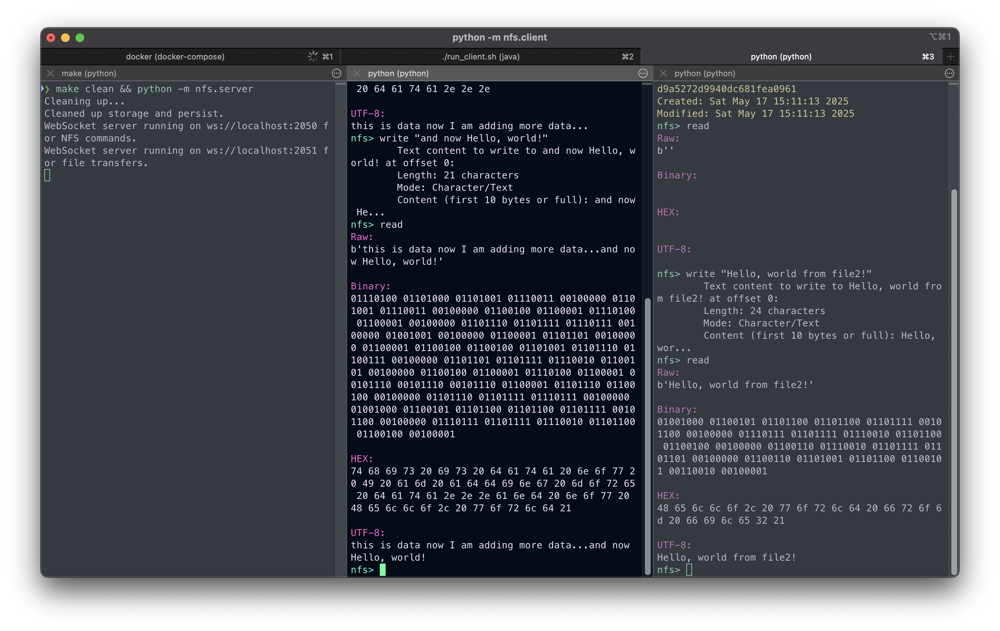

# Network File System (NFS) Lab

A simple (non-robust) NFS implementation in Python using ZooKeeper. Just a proof concept as it only supports simple file operations.

## Introduction

Main tasks of the lab:

* Implement a file-system that supports the following operations: `open`, `read,` `write`, and `close`;
* Implement a server NFS node, and a NFS client;
* Use a form of TCP communication between the server and client;
* 

---

## Required Contents of the Lab Report

| Section                                  | What to include                                                                                                                                                                                                                                                                                              | Key artefacts                                                               |
| ---------------------------------------- | ------------------------------------------------------------------------------------------------------------------------------------------------------------------------------------------------------------------------------------------------------------------------------------------------------------ | --------------------------------------------------------------------------- |
| **1. Design Overview**                   | *High-level architecture diagram* of the server, clients, cache directory and ZooKeeper; description of request/response flow; rationale for chosen data structures and locking strategy.                                                                                                                    | Diagram/image (embed or link), short paragraph per component.               |
| **2. Implementation Details**            | Programming language & libraries; folder / module layout; explanation of crucial algorithms (file-ID generation, cache naming, lock acquisition & release); handling of edge cases (network failure, partial writes, SIGINT).                                                                                | Code snippets (≤15 lines each) with inline commentary.                      |
| **3. Experimental Setup & Test Results** | Test environment (OS, Python version, ZooKeeper version); **concurrency demo with ≥2 clients** showing open-lock-read/write-close cycles; screenshots or terminal logs that prove: 1) correct caching, 2) lock exclusivity, 3) whole-file upload on `close`, 4) read-only access without server round-trips. | Annotated log excerpts or screenshots; timing/throughput table if relevant. |
| **4. Challenges and Solutions**          | Brief description of the main difficulties you encountered (e.g., race conditions, stale cache, PID handling) and how you resolved or mitigated them.                                                                                                                                                        | Bullet list (problem ➜ fix).                                                |
| **5. Conclusion & Future Work**          | Lessons learned; limitations of the current prototype; suggestions for improvements such as security, fault tolerance or performance tuning.                                                                                                                                                                 | 2-3 concise paragraphs.                                                     |
| **6. Appendix**                          | Complete command list to reproduce tests; build/run instructions; any additional references.                                                                                                                                                                                                                 | Command script or Makefile fragment.                                        |

---

### Submission Format

* **Code**

  * `nfs_server.py` (single-process TCP server)
  * `nfs_client.py` (client with local cache and ZooKeeper lock)
* **Report** — one **PDF** named `StudentID_Name_Lab2_Report.pdf` that follows the section order above.
* **Archive** — compress the PDF **and** source files into `StudentID_Name_Lab2.zip`.

> **Deadline:**  23 : 59  on **27 May 2025** (UTC-8).
> Late submissions lose **10 % per day**.&#x20;


## Running ZooKeeper on Docker

```
docker pull
```

### [Experiment 1] ZooKeeper Demo


- 

### [Experiment 2]

## Testing

### Unit-testing

Run the following command to begin unit-testing:
```shell
python -m untitest discover test -v
```

Tested modules:
- [ ] File System \(`nfs.fs`\)
  - [x] File Node \(`nfs.fs.FileNode`\)
  - [x] Directory Node \(`nfs.fs.DirectoryNode`\)
- [ ] Server methods
  - [ ] Open
  - [ ] Close
  - [ ] Write
  - [ ] Read 

## Methodology

## Implementation


## Experiment 2

A `Makefile` is provided to streamline launching the Docker container, NFS server, and client:

1. **`make clean`**  — removes any leftover data.
2. **`make tests`**  — runs unit tests for every Python module.
3. **`make docker`**  — starts the ZooKeeper container (if it fails to launch, restarting the Docker engine usually resolves the issue).
4. **`make`**  — launches both the NFS server and client.

A helper script is also available for the ZooKeeper shell client:

```bash
./run_client.sh
```

Running the script opens the ZooKeeper CLI and connects to the active local instance, just as in Experiment 1.

---

### ZooKeeper Docker Container


### ZooKeeper Shell Client



---

### Demonstration

1. **Start the server, then open the client.**
   With the server running (left pane), launch the client shell with `python -m nfs.client` or simply run `make`.
   

   * We open `file.txt` with `open`. If the file does not exist, the server creates it automatically.
   * Messages in **blue** are server responses, lines in **yellow** show `FileNode` metadata, and all other text is client-side output.
   * Because the server is initially empty, the file is empty as well (observe the result of `read` and the file size).
   * At first open, the server creates an empty file, which the client downloads and **caches locally**. Subsequent `read` and `write` commands affect only this cached copy and do not contact the server.

2. **Write data to the file.**
   

   * We issue `write` to store `"Hello, world!"` in the open file.
   * Running `read` confirms the contents—the raw bytes, hex dump, and UTF-8 string are displayed.
   * These operations modify only the local cache; nothing has yet been committed to the server.

3. **Close the file to commit changes.**
   

   * Executing `close` flushes the cached file back to the server. ZooKeeper releases the lock, and the server sends two confirmation messages (blue).
   * The final response includes updated `FileNode` metadata (yellow); note the increased file size and new modification timestamp.

4. **Re-open the file to verify persistence.**
   

   * Opening the file again shows the same metadata as after the previous `close`.
   * Reading the file returns the data written earlier, confirming that the commit succeeded.
   * Closing the file now completes instantly because no further changes were made.

This sequence demonstrates that local caching, server commits, and ZooKeeper-based locking all operate correctly.

#### Aside

Let's take a look at the inner-workings of the ZooKeeper file lock mechanism that was implemented. The following shows a demo of the state of the ZooKeeper instance as a file was being opened and closed on the client side.



During the process of opening and closing a file, a "lock" is created or deleted from the ZooKeeper instance using the zk Python module. The screenshot above was taken after a new file was opened. From the image, we can observe that:

* An entry named `file.txt` was created at the root of the ZooKeeper instance.
* Inside this entry (`ls /file.txt`), there is a "lock".


This screenshot shows the contents of the `file.txt` entry after the file was closed by the client. Now, the "lock" file has disappeared, indicating that no one currently has the file open.

This confirms that our implemented locking mechanism for the NFS is functioning as expected.


### Problem with two clients opening the same file

Screenshots of the bug:





The error is caused by the file size between the data received from the server and the file node size data not matching.

**Before:**

```python
async def handle_open(self, command):
    parts = shlex.split(command)
    if not len(parts) == 2:
        print("open takes one argument.")
        return

    parts = parts[1:]
    
    file_path = parts[0]
    
    openRequest = OpenRequest()
    response = await self.websocket_comm(
        nfs_server_uri,
        openRequest.encode(Path(file_path))
    )
    
    openResponse = OpenResponse()
    openResponse.decode(response)
    
    if not openResponse.OK:
        print(colored(openResponse.message, "red"))
        return
    
    if not await self.lock(FileNode("", Path(file_path))):
        return
    
    print(colored(openResponse.message, "light_blue"))
    ...

async def lock(self, file_node: FileNode) -> bool:
    # Check if a file is already opened
    if (not self.current_file_node == None) and (not self.current_zk_lock == None):
        print("A File a already opened! Please close it first.")
        return False
    elif (not self.current_file_node == None) or (not self.current_zk_lock == None):
        print("A File was opened? Current tracker got corrupted, resetting...")
        self.current_file_node = None
        self.current_zk_lock = None
    
    try:  
        self.current_file_node = file_node
        await self.zk_lock(self.current_file_node.file_path.as_posix())
        assert not self.current_file_node == None and not self.current_zk_lock == None
    except AssertionError as e:
        print(f"An error occured while locking file: {e}")
        return False

    return True
```

**After:**

```python
async def handle_open(self, command):
    parts = shlex.split(command)
    if not len(parts) == 2:
        print("open takes one argument.")
        return

    parts = parts[1:]
    
    file_path = parts[0]
    
    if not await self.lock(FileNode("", Path(file_path))): # changed
        return
    
    openRequest = OpenRequest()
    response = await self.websocket_comm(
        nfs_server_uri,
        openRequest.encode(Path(file_path))
    )
    
    openResponse = OpenResponse()
    openResponse.decode(response)
    
    if not openResponse.OK:
        print(colored(openResponse.message, "red"))
        return
    
    self.current_file_node = openResponse.file_node # changed
    
    print(colored(openResponse.message, "light_blue"))
    ...

async def lock(self, file_node: FileNode) -> bool:
    # Check if a file is already opened
    if (not self.current_file_node == None) and (not self.current_zk_lock == None):
        print("A File a already opened! Please close it first.")
        return False
    elif (not self.current_file_node == None) or (not self.current_zk_lock == None):
        print("A File was opened? Current tracker got corrupted, resetting...")
        self.current_file_node = None
        self.current_zk_lock = None
    
    try:
        # changed
        await self.zk_lock(file_node.file_path.as_posix())
        assert not file_node == None and not self.current_zk_lock == None
    except AssertionError as e:
        print(f"An error occured while locking file: {e}")
        return False

    return True
```


In summary, the bug was caused by a combination of logic implemented in the wrong order in the `open` handler on the client and the `write` handler on the server. For the former, we have to modifiy the `handle_open` method and move the file lock acquisition to the top before any command it sent to the server. For the latter, the server should always flush the buffer before returning and sending a response back to the client to ensure that the data is actually written. If not, then the next request might get data that is stall or not up-to-date. 

## Experiment 3

In this experiment, we test the file locking mechanism and parallel processing features of the NFS server. The following tests will be conducted:

* With two clients, open the **same file** at the same time
    * The exepcted outcome is that one client would have to wait for the other one to release the lock
    * Whichever client opens the file first, and writes to it, it should properly reflect on the latter client that opens it 
* Ensure that two clients writing to **different files** at the same time are handled properly

### Two clients competing for the same file


### Two clients opeing different files




## References

- https://zookeeper.apache.org/doc/r3.4.5/zookeeperStarted.html#sc_Download
- https://hub.docker.com/_/zookeeper